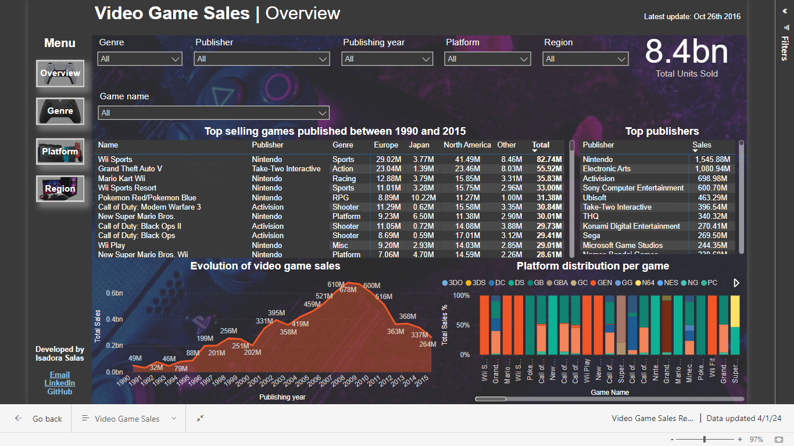
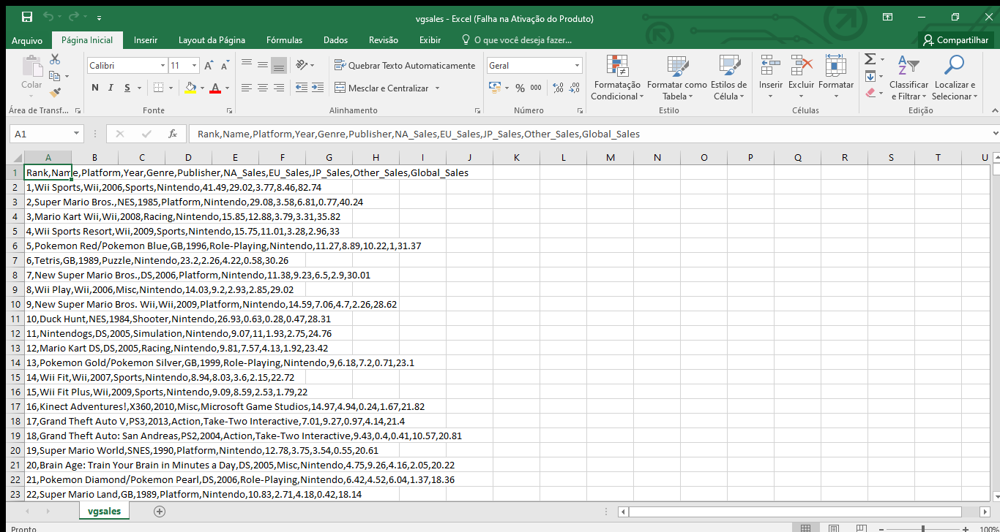
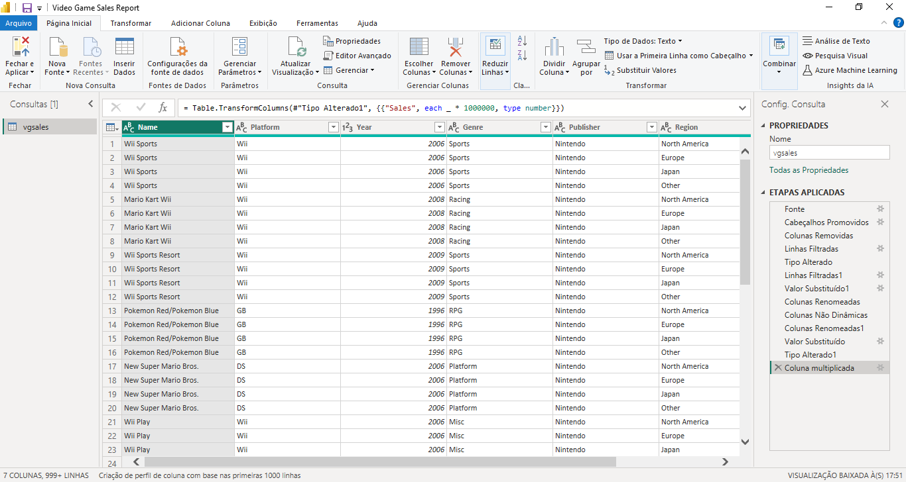
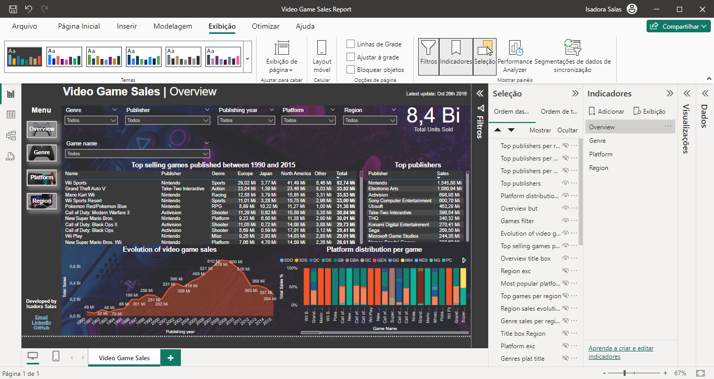

# Video Games Sales Report

## Introduction
This is a straightforward project about the video game industry that sheds some light on the sales performance of the most popular games published from 1990 to 2015.
The report was built on Microsoft Power BI with one Excel CSV database, detailed below.

The full report can be visualized [here](https://app.powerbi.com/links/YDAdRxqOJ-?ctid=2101ad2c-9e83-4758-9e17-e2096775b49a&pbi_source=linkShare)

The PBIX file can be downloaded on this [repository](Video_Game_Sales_Report.pbix).

## Skills and concepts demonstrated
- Microsoft Power Query: Data cleaning, data typing, pivot/unpivot tables.
- Microsoft Power BI: Bookmarks, Selection pane, Tooltips, Buttons, Page navigation, Graphic visuals and tables, Filters.
- Data analytics and business intelligence: contextual analysis of numbers and visuals, strategic insights and business recommendations.

## Problem statement
The main objective of this report is to showcase my data analytics skills, and I chose video games because this is the ultimate industry that I want to work in.
Based on that, my focus was to get some answers on:
- What are the most popular games and how many units are those selling?
- What are the most popular game genres?
- What are the most popular game platforms?
- Which world region consumes more video games?

## Data source
[Video Game Sales | Kaggle](https://www.kaggle.com/datasets/gregorut/videogamesales/data)
- CSV dataset
- List of video games with sales greater than 100,000 copies
- Extracted on October 26th 2016
- 11 columns and 16,598 rows
- Columns: Rank, Game name, Platform, Year, Genre, Publisher, NA Sales, EU Sales, JP Sales, Other Sales, Global Sales (Sales columns are in million).

## Data cleaning and transformation
- Removed columns Rank and Global Sales: the Rank won’t be used because the data will be ordered by the highest sales, and the Global or Total Sales will be automatically calculated as a sum of all sales
- Filtered out “Year: N/A” due to incomplete data
- Year filter applied between 1990 and 2015 to narrow down the data
- Unpivot all Sales columns to reduce from 4 to 2 columns: Region and Sales
- Replaced dot with comma on the numbers due to Brazil number configuration
- Changed Sales column data type to Numbers and multiplied it by 1 million, so we can get the whole number.

## Data model
Since it is a very simple and straghtforward dataset, there is only one fact table, so no dimensional tables were added to this project at the moment.

## Data visualization
The report has only one page, and uses Bookmarks to navigate through sliced data.
The data was organized in four topics: Overview, Genre, Platform and Region.
All bookmarks have the filters Genre, Publisher, Publishing year, Platform and Region, and a Card with the total units sold.
All elements were properly named, so the organization of each bookmark is cleaner.

The **Overview** bookmark brings a matrix table with a list of all games present in the dataset, and it is organized by Total Sales to highlight the top selling games published in the mentioned period. It also has a matrix table with the top publishers, an area chart showcasing the evolution of sales along the publishing years, and a percentage column chart with the platform distribution per game - since most games were released in different platforms, it is interesting to see the ones that performed better in terms of sales.

The **Genre** bookmark has the data organized to understand the sales per genre and region in a column chart, the evolution of sales for each genre throughout the years in a line chart, and the platform distribution per genre in a pie chart, with its own filter to see one genre at a time. There is also a matrix table listing the top games per genre, and another one with the top publishers per genre.

The **Platform** bookmark shows the most popular genres in each gaming platform in a tree chart (with a separate filter to see one platform at a time), the sales evolution of the platforms along the publishing years in a line chart, the regional sales per platform in a percentage column chart, a matrix table listing the top games for each platform, and one for the top publishers.

The **Region** bookmark focuses on the data sliced by macro regions, divided in North America, Europe, Japan and Other. The visuals are: one column chart with the regional sales per genre, one area chart showing the sales evolution throughout the years for each region, one donut chart showcasing the most popular platforms in each region (along with an exclusive filter to see one region at a time), one matrix table with the top games per region, and the last one of top publishers per region.

## Data analysis
The dashboard can answer all the questions brought up during the **Problem statement** phase, and it curiously reveals even more details.
With the visuals in the **Overview** bookmark, we can spot the following:
- The top 1 selling game in this dataset is the Wii Sports, which only came out for the Wii platform and it sold over 82.74 million copies all around the world, but does this mean that the Wii platform is the most popular one?
- The second game is Grand Theft Auto V, it has come out on 5 different platforms, and despite that, its total sales volume was 26 million units below the top 1 game. So is it worth it to publish a game on so many different platforms? Or is it because GTA V was first released in 2013, and since this dataset is only until 2015, it doesn’t really show the full sales potential of the game?
- The top publishing year in sales was 2008, with nearly 678 million units of games sold. After that, the numbers are continuously dropping, except that in 2013 there is a minor recovery, then it goes back downwards. So has the video game industry reached its peak already in terms of sales volume? 
- The top publisher is Nintendo, responsible for the top selling game as well. As we dig through the report, we can easily see how Nintendo is extremely relevant in a number of different scenarios. What benchmark can be done regarding Nintendo’s strategies and operations?

Looking at the **Genre** bookmark visuals, the Action games are the first among the top sellers.
- The Action genre really started to gather numbers in 2002 and its peak was in 2009 with over 139 million units sold. Although the sales numbers started to drop after that, it is possible to conclude that Action is a relevant genre and its investment should be considered by companies that want to stay relevant in the market.
- The second most popular genre are Sports games, with its peak in 2006. By clicking on the Sports 2006 dot in the line chart, we can see that the top game responsible for that is the Wii Sports, mentioned before as the top 1 selling game of this dataset. Since then, the genre had another peak in 2009 with the Wii Sports Resort game, reinforcing the power of the Wii Sports brand. What are the factors that made this such a remarkable brand for its users?
- The RPG genre is only the fourth most popular here, but what gets my attention is how it is the most popular genre in Japan, with over 333 million units sold, while the Action genre has sold 144 million units in the region. This highlights the different user profiles per region, and it could back up a company’s decision of releasing RPG games with a higher focus in Japan than in the rest of the world.
- The Action genre is most present on the PS3, PS2 and XBox360 platforms, while the RPG genre was released mostly for DS, PS2 and GB platforms. Can we correlate these to the regions where these genres are highly popular? We can check that on the Region bookmark further ahead.

The **Platform** bookmark page brings another vision to the whole data, and it clearly highlights the top performance of the PS2.
- The PS2 had an amazing performance right in its first year of 2000, and in 2001 it climbed up all the way to selling over 166 million dollars, almost topping its predecessor PS in 1998, so the PS2 did in 1 year the annual selling that the PS took 5 years to reach. PS2 was also the top selling platform for 5 years straight (2001 to 2005), while the Wii was top selling only for 4 years in a row.
- While the X360 was the top selling platform of the whole dataset, its only top year was 2010, when it performed better than its main competitors at the time, Wii and PS3.
- PC is one of the oldest platforms, since it does not have any generations to progress to. Even so, its top selling performance was only over 35 million dollars in 2011. Does this make the PC a bad platform to invest in? Is this data reliable when it comes to PC numbers? Or are those numbers being affected by heavy piracy of the PC games? 
- Action is the top selling genre on PS2, PS3 and PS4, showing the potential of investing in this combination of genre and platform, and also how the players of the PS generations are faithful to the genre. On the Wii it is the Sports genre, mostly influenced by the Wii Sports, but the scenario changes when we look at the WiiU, with the Platform genre as the most popular one. What does it say about the Nintendo players? Has their preferences changed over the years?

Finally, the **Region** bookmark page highlights another view which may be critical for business decisions. Some possible insights are:
- North America is the top selling region overall, with even Nintendo's Wii Sports being the top selling game in the region too, plus the Action and Sports genre being the most populars. Europe has the same scenario of top selling game and genres. The view changes drastically for Japan, with the best genre performance coming from RPG games. So is it a good strategic decision to launch an Action game in all those regions? Or would it be more effective to focus its release only in North America and Europe? 
- Overall, Japan's numbers are quite low, however we do need to consider some context information such as the population of Japan (127 million people in 2015), and the fact that two of the major players in the industry (Nintendo and Sony) are originally from Japan. So how does a relatively small country like Japan compare to entire continental regions like North America and Europe? Does it make sense to have Japan as an entire region in this dataset? What about the entirety of the Asian continent, how would it perform in this comparison?
- Even though the PS2 is the best selling platform in this dataset, the top selling platform in North America is the X360, probably considering that the manufacturer Microsoft is also a North American company. The PS2 and Wii are right behind X360 with relatively smaller differences, so clearly North America is a strong market for all main platforms.

## Conclusion and recommendations

The dashboard gives an insightful overview on the Video Games market, and it can support decisions regarding:
- Which game genres have been performing better than others, and if a particular genre has been growing in popularity, on which platforms and regions. Besides, if a new genre comes up, it is possible to try and predict if it will be succesfull based on the performance of similar genres.
- Which regions have been selling best and its most popular genres. This could help base a decision on wether a new game should be released worldwide, if it should be more focused on a particular region, also depending on its genre and platform.
- In which platforms should you invest your new game, based on the combination of factors such as region and genre.
- Who are the best seling publishers? Do they focus on any specific regions, genres, or platforms? 

Based on all data gathered and insights revealed, this dashboard proves to be relevant to all market players and stakeholders, especially when holding the most up do date information. This can be the difference between success and failure of a game launch and its performance throughout the years.

**End.**
